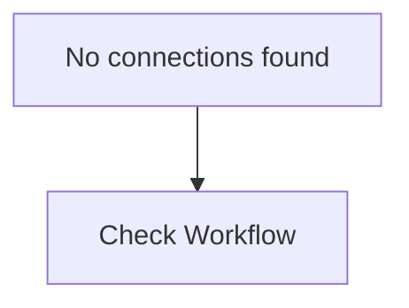

# Automated Customer Feedback Analyzer

## Overview
This is an exported n8n workflow for **Automated Customer Feedback Analyzer**.

## Nodes Included
- **Webhook** (n8n-nodes-base.webhook)

## Workflow Diagram

## Setup Instructions
1. Import this workflow into your n8n instance.
2. Review the nodes and configure necessary credentials.
3. Activate the workflow.
